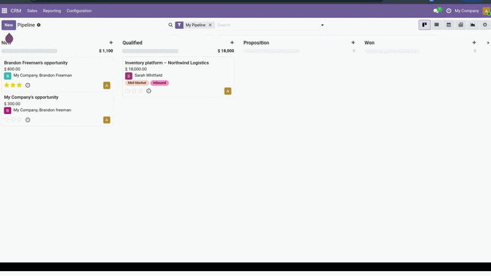

<div align="center">


# AI Reply Drafter for Odoo CRM

**Draft personalized email replies to leads with an LLM — streamed live, then sent from Odoo's own composer. The salesperson always reviews; it never auto-sends.**


</div>

---

<!-- Replace this file with your screen recording (keep the name demo.gif). -->


## What it does

Add a **Draft Reply** button to any lead/opportunity. The module reads the lead's
data and its **full chatter conversation**, sends them to a configurable LLM with
a configurable system prompt, and **streams** back a personalized email draft you
can edit and send — without leaving the record.

1. Open an opportunity that has a conversation in its chatter.
2. Click **Draft Reply** → the draft **streams in live** in an editable box.
3. Tweak it if you like, then **Send** (posts to the chatter and emails the
   customer) — or **Edit in composer…** for the full composer.
4. Every generation is logged with token counts and a cost estimate.

## Highlights

- **Three providers, one abstraction** — Anthropic (Claude), OpenAI, or local
  **Ollama**. Any OpenAI-compatible gateway (e.g. **OpenRouter**) works via a
  base-URL override. One provider per configuration.
- **Live streaming** to an OWL 2 component over Server-Sent Events.
- **You stay in control** — the draft is editable and nothing is sent until you
  click Send. No auto-send.
- **Auditable** — a log model records provider, model, token usage, cost
  estimate, lead, user and timestamp for every generation.
- **Secrets stay secret** — API keys live in `ir.config_parameter`, never in code
  or the repo.

## How it works

```
crm.lead  ──Draft Reply──▶  wizard (crm.ai.reply.wizard)
                                  │  OWL component opens an SSE stream
                                  ▼
   /crm_ai_reply_drafter/stream  ──▶  crm.ai.reply.service
                                          ├─ prompt_builder  (lead fields + chatter)
                                          └─ providers       (Anthropic / OpenAI / Ollama)
                                  │  tokens stream back, draft shown live
                                  ▼
        Send ──▶ chatter + email (Odoo mail)      log ──▶ crm.ai.reply.log
```

The network call is isolated behind a small service so providers can be swapped
without touching the Odoo layer — and so it can be **mocked in tests**.

## Requirements

- Odoo **19.0 Community**, modules `crm` and `mail`.
- The Python SDK for the **one** provider you configure (see
  [`requirements.txt`](requirements.txt)):
  | Provider | Install |
  |---|---|
  | Anthropic | `pip install anthropic` |
  | OpenAI / OpenRouter / compatible | `pip install openai` |
  | Ollama | `requests` (already ships with Odoo) |

  These are intentionally **not** in the manifest's `external_dependencies`: you
  only use one provider, so requiring all three would block installation. Each
  client imports its SDK lazily and raises a clear error if it's missing.

## Install

```bash
# with the module folder on your addons path
odoo-bin -c odoo.conf -d <db> -i crm_ai_reply_drafter --stop-after-init
```

## Configuration

**Settings → AI Reply Drafter:**

| Setting | Notes |
|---|---|
| Provider | Anthropic, OpenAI, or Ollama (local) |
| API key | Stored as a system parameter; never committed |
| API base URL | *(OpenAI provider)* leave empty for OpenAI, or set `https://openrouter.ai/api/v1` for OpenRouter |
| Model | e.g. `claude-opus-4-8`, `gpt-4o`, `anthropic/claude-sonnet-4`, `llama3.1` |
| System prompt | The instruction template that steers every draft |
| Max context messages | How many recent chatter messages to include |

See [`.env.example`](.env.example) for the optional environment-variable
fallbacks used in local dev / CI.

## Privacy

Drafting sends the lead's fields and chatter to the **single configured LLM
provider** — the one place data leaves your Odoo instance. It is sent only to
that provider, and the salesperson reviews every draft before anything is sent.

## Testing

The LLM call is fully mocked, so the suite needs no key and no network:

```bash
odoo-bin -c odoo.conf -d <db> -u crm_ai_reply_drafter --test-enable --stop-after-init
```

## Project structure

```
crm_ai_reply_drafter/
├── models/         res.config.settings · crm.lead · crm.ai.reply.log
├── services/       providers · prompt_builder · llm_service   (plain, testable Python)
├── wizard/         crm.ai.reply.wizard (Send / Edit-in-composer)
├── controllers/    SSE streaming endpoint
├── static/src/     OWL component (live streaming + editable draft)
├── views/ · data/ · security/
└── tests/          test_ai_service.py  (LLM mocked)
```

## Out of scope (v1)

Multi-language detection (handled via the prompt), RAG/fine-tuning over a
knowledge base, auto-send, and running multiple providers in parallel.

## License

[LGPL-3](LICENSE) — matching Odoo's licensing.

## Author

**Emin Ahmed** · [github.com/emin-ahmed](https://github.com/emin-ahmed)
